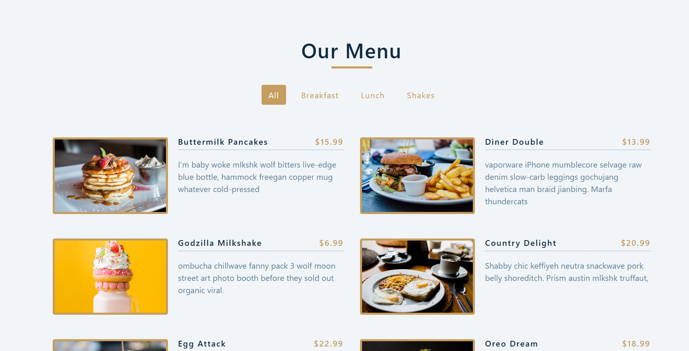

# 🍽️ Restaurant Menu

A simple and responsive web app to display a restaurant's menu and item prices.

---

## 📌 Features

- Built with **React** and beautiful icons from **React Icons**
- Fully **responsive** design for desktop and mobile
- Filter menu items by category (Breakfast, Lunch, Shakes)
- Displays item name, price, image, and description

---

## 🚀 Getting Started

To run the project locally:

```bash
npm install
npm start
```
Then open your browser at http://localhost:3000.
---

🖼️ Preview



